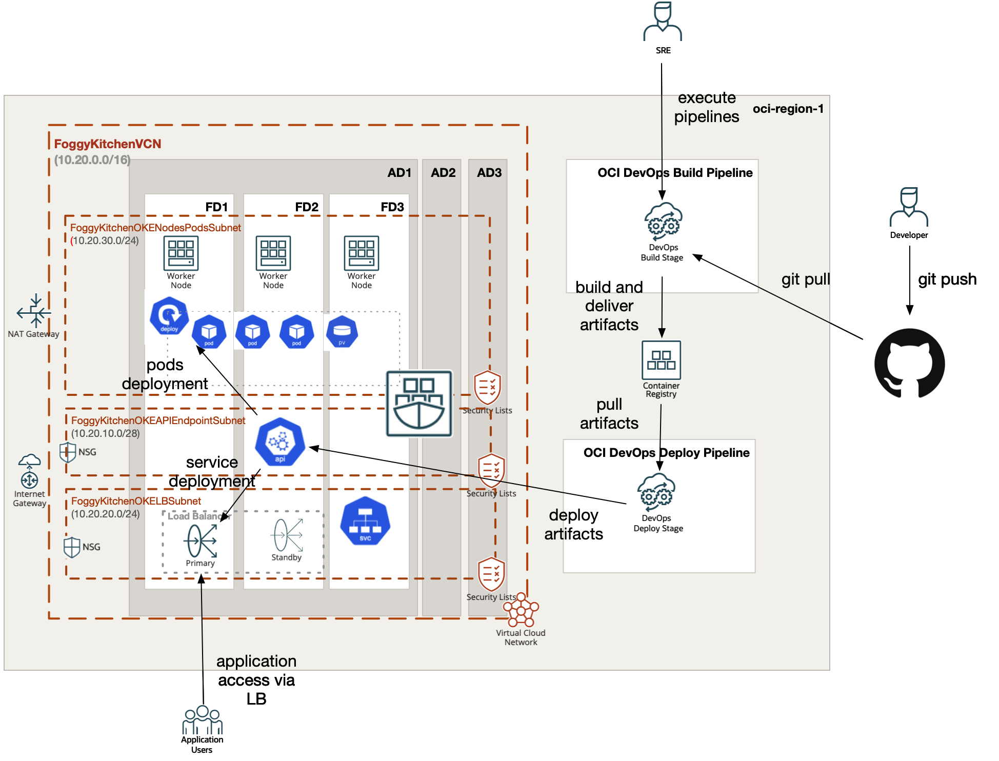

# OCI Container Engine for Kubernetes (aka OCI OKE) deployed with OCI DevOps Services

## Project description

In this repository, I have documented my hands on experience with Terrafrom for the purpose of Container Engine for Kubernetes (aka OCI OKE) deployment with OCI DevOps Services. This set of HCL based Terraform files which can customized according to any requirements.  

## Topology Diagram 

With the usage of this example HCL code you can build topology documented by diagram below. This topology is extremly simplified for education purposes and rather cannot be used for production implementations. 



## How to use code 

### Deploy Using Oracle Resource Manager

1. Click [](https://cloud.oracle.com/resourcemanager/stacks/create?region=home&zipUrl=https://github.com/mlinxfeld/terraform-oci-oke-devops/releases/latest/download/terraform-oci-oke-devops-stack-latest.zip)

    If you aren't already signed in, when prompted, enter the tenancy and user credentials.

2. Review and accept the terms and conditions.

3. Select the region where you want to deploy the stack.

4. Follow the on-screen prompts and instructions to create the stack.

5. After creating the stack, click **Terraform Actions**, and select **Plan**.

6. Wait for the job to be completed, and review the plan.

    To make any changes, return to the Stack Details page, click **Edit Stack**, and make the required changes. Then, run the **Plan** action again.

7. If no further changes are necessary, return to the Stack Details page, click **Terraform Actions**, and select **Apply**. 

### Deploy Using the Terraform CLI

#### STEP 1.

Clone the repo from GitHub.com by executing the command as follows and then go to terraform-oci-private-oke directory:

```
[opc@terraform-server ~]$ git clone https://github.com/mlinxfeld/terraform-oci-oke-devops
Cloning into 'terraform-oci-oke-devops'...
remote: Enumerating objects: 26, done.
remote: Counting objects: 100% (26/26), done.
remote: Compressing objects: 100% (23/23), done.
remote: Total 26 (delta 1), reused 25 (delta 0), pack-reused 0
Receiving objects: 100% (26/26), 16.39 KiB | 1.09 MiB/s, done.
Resolving deltas: 100% (1/1), done.

[opc@terraform-server ~]$ cd terraform-oci-oke-devops/

[opc@terraform-server terraform-oci-oke-devops]$ ls -latr
total 396
-rw-rw-r--.  1 opc opc   2136 Dec 13 17:16 devops_deploy.tf
-rw-rw-r--.  1 opc opc   5941 Dec 13 17:16 devops_build.tf
-rw-rw-r--.  1 opc opc   1317 Dec 13 17:16 devops_artifacts.tf
-rw-rw-r--.  1 opc opc   1049 Dec 13 17:16 datasources.tf
-rw-rw-r--.  1 opc opc    615 Dec 13 17:16 .gitignore
-rw-rw-r--.  1 opc opc   3500 Dec 13 17:16 variables.tf
-rw-rw-r--.  1 opc opc     80 Dec 13 17:16 tls.tf
-rw-rw-r--.  1 opc opc    749 Dec 13 17:16 provider.tf
-rw-rw-r--.  1 opc opc    501 Dec 13 17:16 outputs.tf
-rw-rw-r--.  1 opc opc   2035 Dec 13 17:16 oke.tf
-rw-rw-r--.  1 opc opc  16085 Dec 13 17:16 network.tf
drwxrwxr-x.  2 opc opc     25 Dec 13 17:16 manifest
-rw-rw-r--.  1 opc opc   2156 Dec 13 17:16 locals.tf
-rw-rw-r--.  1 opc opc   2711 Dec 13 17:16 devops_repository.tf
-rw-rw-r--.  1 opc opc   1946 Dec 13 17:16 devops_project.tf
-rw-rw-r--.  1 opc opc   1081 Dec 13 17:16 devops_policies.tf
-rw-r--r--.  1 opc opc     27 Dec 13 17:27 README.md
drwx------. 31 opc opc   4096 Dec 13 17:27 ..
drwxrwxr-x.  4 opc opc   4096 Dec 13 17:27 .
drwxrwxr-x.  8 opc opc   4096 Dec 13 17:29 .git
```

#### STEP 2.

Within web browser go to URL: https://www.terraform.io/downloads.html. Find your platform and download the latest version of your terraform runtime. Add directory of terraform binary into PATH and check terraform version:

```
[opc@terraform-server terraform-oci-oke-devops]$ export PATH=$PATH:/home/opc/terraform

[opc@terraform-server terraform-oci-oke-devops]$ terraform --version

Terraform v1.0.0

Your version of Terraform is out of date! The latest version
is 1.2.2. You can update by downloading from https://www.terraform.io/downloads.html
```

#### STEP 3. 
Next create environment file with TF_VARs:

```
[opc@terraform-server terraform-oci-oke-devops]$ vi setup_oci_tf_vars.sh
export TF_VAR_user_ocid="ocid1.user.oc1..aaaaaaaaob4qbf2(...)uunizjie4his4vgh3jx5jxa"
export TF_VAR_tenancy_ocid="ocid1.tenancy.oc1..aaaaaaaas(...)krj2s3gdbz7d2heqzzxn7pe64ksbia"
export TF_VAR_compartment_ocid="ocid1.tenancy.oc1..aaaaaaaasbktyckn(...)ldkrj2s3gdbz7d2heqzzxn7pe64ksbia"
export TF_VAR_fingerprint="00:f9:d1:41:bb:57(...)82:47:e6:00"
export TF_VAR_private_key_path="/tmp/oci_api_key.pem"
export TF_VAR_region="eu-frankfurt-1"
export TF_VAR_ocir_user_name="<oci_iam_user>"
export TF_VAR_ocir_user_password="<oci_iam_auth_token>"

[opc@terraform-server terraform-oci-oke-devops]$ source setup_oci_tf_vars.sh
```

#### STEP 4.
Run *terraform init* with upgrade option just to download the lastest neccesary providers:

```
[opc@terraform-server terraform-oci-oke-devops]$ terraform init -upgrade


Initializing the backend...

Initializing provider plugins...
- Finding latest version of hashicorp/oci...
- Finding latest version of hashicorp/null...
- Finding latest version of hashicorp/tls...
- Finding latest version of hashicorp/random...
- Installing hashicorp/oci v4.101.0...
- Installed hashicorp/oci v4.101.0 (signed by HashiCorp)
- Installing hashicorp/null v3.2.1...
- Installed hashicorp/null v3.2.1 (signed by HashiCorp)
- Installing hashicorp/tls v4.0.4...
- Installed hashicorp/tls v4.0.4 (signed by HashiCorp)
- Installing hashicorp/random v3.4.3...
- Installed hashicorp/random v3.4.3 (signed by HashiCorp)

Terraform has created a lock file .terraform.lock.hcl to record the provider
selections it made above. Include this file in your version control repository
so that Terraform can guarantee to make the same selections by default when
you run "terraform init" in the future.

Terraform has been successfully initialized!

You may now begin working with Terraform. Try running "terraform plan" to see
any changes that are required for your infrastructure. All Terraform commands
should now work.

If you ever set or change modules or backend configuration for Terraform,
rerun this command to reinitialize your working directory. If you forget, other
commands will detect it and remind you to do so if necessary.
```

#### STEP 5.
Run *terraform apply* to provision the content of this repo (type **yes** to confirm the the apply phase):

```
[opc@terraform-server terraform-oci-oke-devops]$ terraform apply

data.oci_containerengine_node_pool_option.FoggyKitchenOKEClusterNodePoolOption: Reading...
data.oci_core_services.FoggyKitchenAllOCIServices: Reading...
data.oci_identity_availability_domains.ADs: Reading...
data.oci_containerengine_cluster_option.FoggyKitchenOKEClusterOption: Reading...
data.oci_objectstorage_namespace.test_namespace: Reading...
data.oci_identity_region_subscriptions.home_region_subscriptions: Reading...
data.oci_identity_regions.oci_regions: Reading...
data.oci_objectstorage_namespace.test_namespace: Read complete after 0s [id=ObjectStorageNamespaceDataSource-3269541301]
data.oci_identity_regions.oci_regions: Read complete after 0s [id=IdentityRegionsDataSource-0]
data.oci_identity_region_subscriptions.home_region_subscriptions: Read complete after 0s [id=IdentityRegionSubscriptionsDataSource-3269541301]
data.oci_containerengine_cluster_option.FoggyKitchenOKEClusterOption: Read complete after 1s [id=ContainerengineClusterOptionDataSource-1870923232]
data.oci_identity_availability_domains.ADs: Read complete after 1s [id=IdentityAvailabilityDomainsDataSource-3269541301]
data.oci_core_services.FoggyKitchenAllOCIServices: Read complete after 1s [id=CoreServicesDataSource-0]
data.oci_containerengine_node_pool_option.FoggyKitchenOKEClusterNodePoolOption: Read complete after 3s [id=ContainerengineNodePoolOptionDataSource-1870923232]

Terraform used the selected providers to generate the following execution plan. Resource actions are indicated with the following symbols:
  + create

Terraform will perform the following actions:

  # null_resource.FoggyKitchenCloneRepositoryFromGitHub will be created
  + resource "null_resource" "FoggyKitchenCloneRepositoryFromGitHub" {
      + id = (known after apply)
    }

  # null_resource.FoggyKitchenCloneRepositoryLocally will be created
  + resource "null_resource" "FoggyKitchenCloneRepositoryLocally" {
      + id = (known after apply)
    }

  # null_resource.FoggyKitchenCopyFiles will be created
  + resource "null_resource" "FoggyKitchenCopyFiles" {
      + id = (known after apply)
    }

(...)

  # tls_private_key.public_private_key_pair will be created
  + resource "tls_private_key" "public_private_key_pair" {
      + algorithm                     = "RSA"
      + ecdsa_curve                   = "P224"
      + id                            = (known after apply)
      + private_key_openssh           = (sensitive value)
      + private_key_pem               = (sensitive value)
      + private_key_pem_pkcs8         = (sensitive value)
      + public_key_fingerprint_md5    = (known after apply)
      + public_key_fingerprint_sha256 = (known after apply)
      + public_key_openssh            = (known after apply)
      + public_key_pem                = (known after apply)
      + rsa_bits                      = 2048
    }

Plan: 45 to add, 0 to change, 0 to destroy.

Changes to Outputs:
  + cluster_instruction = (known after apply)
  + oracle_linux_images = [
      + "ocid1.image.oc1.eu-frankfurt-1.aaaaaaaamprqxerpet6nbdklesmebpty6k2jcsqurawdlzgiobfpy3s337jq",
      + "ocid1.image.oc1.eu-frankfurt-1.aaaaaaaaqz3y3bnqusfksz44ysicyikiw6kdhkahjrmvrhubtxwtrfh2onsq",
    ]

Do you want to perform these actions?
  Terraform will perform the actions described above.
  Only 'yes' will be accepted to approve.

  Enter a value: Yes

(...)

tls_private_key.public_private_key_pair: Creating...
random_id.tag: Creating...
null_resource.FoggyKitchenCloneRepositoryFromGitHub: Creating...
null_resource.FoggyKitchenCloneRepositoryFromGitHub: Provisioning with 'local-exec'...
null_resource.FoggyKitchenCloneRepositoryFromGitHub (local-exec): Executing: ["/bin/sh" "-c" "rm -rf ./helm-foggykitchen-hello-world-remote"]
random_id.tag: Creation complete after 0s [id=3ws]
null_resource.FoggyKitchenCloneRepositoryFromGitHub: Provisioning with 'local-exec'...
null_resource.FoggyKitchenCloneRepositoryFromGitHub (local-exec): Executing: ["/bin/sh" "-c" "git clone https://github.com/mlinxfeld/helm-foggykitchen-hello-world.git helm-foggykitchen-hello-world-remote; ls -lart helm-foggykitchen-hello-world-remote"]
null_resource.FoggyKitchenCloneRepositoryFromGitHub (local-exec): Cloning into 'helm-foggykitchen-hello-world-remote'...
null_resource.FoggyKitchenCloneRepositoryFromGitHub (local-exec): total 24
null_resource.FoggyKitchenCloneRepositoryFromGitHub (local-exec): drwxrwxr-x. 6 opc opc 4096 Dec 13 18:05 ..
null_resource.FoggyKitchenCloneRepositoryFromGitHub (local-exec): -rw-rw-r--. 1 opc opc 1858 Dec 13 18:05 build_spec.yaml
null_resource.FoggyKitchenCloneRepositoryFromGitHub (local-exec): -rw-rw-r--. 1 opc opc   32 Dec 13 18:05 README
null_resource.FoggyKitchenCloneRepositoryFromGitHub (local-exec): -rw-rw-r--. 1 opc opc   80 Dec 13 18:05 Dockerfile
null_resource.FoggyKitchenCloneRepositoryFromGitHub (local-exec): -rw-rw-r--. 1 opc opc   28 Dec 13 18:05 index.html
null_resource.FoggyKitchenCloneRepositoryFromGitHub (local-exec): drwxrwxr-x. 3 opc opc   60 Dec 13 18:05 helm
null_resource.FoggyKitchenCloneRepositoryFromGitHub (local-exec): drwxrwxr-x. 8 opc opc 4096 Dec 13 18:05 .git
null_resource.FoggyKitchenCloneRepositoryFromGitHub (local-exec): drwxrwxr-x. 4 opc opc  103 Dec 13 18:05 .
null_resource.FoggyKitchenCloneRepositoryFromGitHub: Creation complete after 1s [id=1895657853339102405]
tls_private_key.public_private_key_pair: Creation complete after 1s [id=f77b611db23d5dbfe97bb2e2e0dfa93190ae12ec]
oci_identity_compartment.FoggyKitchenCompartment: Creating...

(...)

oci_containerengine_node_pool.FoggyKitchenOKENodePool: Still creating... [2m20s elapsed]
oci_containerengine_node_pool.FoggyKitchenOKENodePool: Still creating... [2m30s elapsed]
oci_containerengine_node_pool.FoggyKitchenOKENodePool: Still creating... [2m40s elapsed]
oci_containerengine_node_pool.FoggyKitchenOKENodePool: Still creating... [2m50s elapsed]
oci_containerengine_node_pool.FoggyKitchenOKENodePool: Still creating... [3m0s elapsed]
oci_containerengine_node_pool.FoggyKitchenOKENodePool: Still creating... [3m10s elapsed]
oci_containerengine_node_pool.FoggyKitchenOKENodePool: Creation complete after 3m18s [id=ocid1.nodepool.oc1.eu-frankfurt-1.aaaaaaaa4xl46vzgephcwgnbskpi3ogj2gvxzg5kruqg4o7jcnqb7glgrt6q]

Apply complete! Resources: 45 added, 0 changed, 0 destroyed.

Outputs:

cluster_instruction = <<EOT
1.  Open OCI Cloud Shell.

2.  Execute below command to setup OKE cluster access:

$ oci ce cluster create-kubeconfig --region eu-frankfurt-1 --cluster-id ocid1.cluster.oc1.eu-frankfurt-1.aaaaaaaakagxamw62avt5zac45y25vwwtrizjijqy6aovfhnqc6lcxhtczgq

3.  Get PODs names:

$ kubectl get pods

4.  Get services

$ kubectl get services


EOT
oracle_linux_images = [
  "ocid1.image.oc1.eu-frankfurt-1.aaaaaaaamprqxerpet6nbdklesmebpty6k2jcsqurawdlzgiobfpy3s337jq",
  "ocid1.image.oc1.eu-frankfurt-1.aaaaaaaaqz3y3bnqusfksz44ysicyikiw6kdhkahjrmvrhubtxwtrfh2onsq",
]
```

#### STEP 6.
After testing the environment you can remove the OCI OKE infra. You should just run *terraform destroy* (type **yes** for confirmation of the destroy phase):

```
[opc@terraform-server terraform-oci-oke-devops]$ terraform destroy -auto-approve
tls_private_key.public_private_key_pair: Refreshing state... [id=c10a1ee09f03f4c04f47c87045422385cfb72391]
random_id.tag: Refreshing state... [id=X4s]
null_resource.FoggyKitchenCloneRepositoryFromGitHub: Refreshing state... [id=4151171365357558956]
data.oci_identity_regions.oci_regions: Reading...
data.oci_identity_region_subscriptions.home_region_subscriptions: Reading...
data.oci_objectstorage_namespace.test_namespace: Reading...
data.oci_objectstorage_namespace.test_namespace: Read complete after 0s [id=ObjectStorageNamespaceDataSource-3269541301]
data.oci_identity_regions.oci_regions: Read complete after 0s [id=IdentityRegionsDataSource-0]
data.oci_identity_region_subscriptions.home_region_subscriptions: Read complete after 0s [id=IdentityRegionSubscriptionsDataSource-3269541301]
data.oci_identity_availability_domains.ADs: Reading...
data.oci_containerengine_cluster_option.FoggyKitchenOKEClusterOption: Reading...
data.oci_containerengine_node_pool_option.FoggyKitchenOKEClusterNodePoolOption: Reading...
data.oci_core_services.FoggyKitchenAllOCIServices: Reading...
data.oci_identity_availability_domains.ADs: Read complete after 0s [id=IdentityAvailabilityDomainsDataSource-3269541301]
data.oci_containerengine_cluster_option.FoggyKitchenOKEClusterOption: Read complete after 0s [id=ContainerengineClusterOptionDataSource-1870923232]
oci_identity_compartment.FoggyKitchenCompartment: Refreshing state... [id=ocid1.compartment.oc1..aaaaaaaayxvhhjidfxsq35muvshgxv62ac2mn6mi2yo2xqzsq53jgkuozfwq]
data.oci_core_services.FoggyKitchenAllOCIServices: Read complete after 1s [id=CoreServicesDataSource-0]
oci_ons_notification_topic.FoggyKitchenDevOpsNotificationTopic: Refreshing state... [id=ocid1.onstopic.oc1.eu-frankfurt-1.aaaaaaaaduamfzkn3bynojszk3ictg42avtnz7rxj4v5mydmwaydgrv6q56a]
oci_logging_log_group.FoggyKitchenDevOpsProjectLogGroup: Refreshing state... [id=ocid1.loggroup.oc1.eu-frankfurt-1.amaaaaaanlc5nbyax4wmeek5zwtwmjuaj6vtywmd22uuyyc6afz4bhuhiemq]
oci_identity_dynamic_group.FoggyKitchenDevOpsProjectPipelineDynamicGroup: Refreshing state... [id=ocid1.dynamicgroup.oc1..aaaaaaaanl7o2hu5q7vv3l7gc5rwlpf7h3f6ot6nghm6qyed4mxom43hh65a]
oci_artifacts_container_repository.FoggyKitchenDevOpsProjectContainerRepositoryHelm: Refreshing state... [id=ocid1.containerrepo.oc1.eu-frankfurt-1.0.ociobenablement.aaaaaaaamvsism5h6ufuaffxvherqcy7ir3eysdnhlb4qof5qoc4hn25l3kq]
oci_artifacts_container_repository.FoggyKitchenDevOpsProjectContainerRepository: Refreshing state... [id=ocid1.containerrepo.oc1.eu-frankfurt-1.0.ociobenablement.aaaaaaaanadtbfcmivaa455ee6tya2vd3dlyey3cyg4t55ll2da4zwhgp4ya]
oci_core_virtual_network.FoggyKitchenVCN: Refreshing state... [id=ocid1.vcn.oc1.eu-frankfurt-1.amaaaaaanlc5nbyarbyqibw4zclh7vktbs2vy57utv3vn7syfhscb6tjiwxa]
oci_identity_policy.FoggyKitchenDevOpsProjectPipelinePolicy: Refreshing state... [id=ocid1.policy.oc1..aaaaaaaawfmwwaw4am52rg2safdkposiqoa7d3roo3s7nbl3yrnupdgmvjla]
oci_core_service_gateway.FoggyKitchenServiceGateway: Refreshing state... [id=ocid1.servicegateway.oc1.eu-frankfurt-1.aaaaaaaan5sz3vh5z432pmnitb4garpukmd7cwz47wkyu6zncyudlhbgoeiq]
oci_core_internet_gateway.FoggyKitchenInternetGateway: Refreshing state... [id=ocid1.internetgateway.oc1.eu-frankfurt-1.aaaaaaaa2arz3cnoebgo3wa7bqw3iu3bvvclc3mgq3sxm3x7tnsbi32cn6oq]
oci_core_security_list.FoggyKitchenOKEAPIEndpointSecurityList: Refreshing state... [id=ocid1.securitylist.oc1.eu-frankfurt-1.aaaaaaaaz4pkvisggp25wvor46xsj56sglbohzuusavmnm5t322cc7r7rb2q]
oci_core_network_security_group.FoggyKitchenOKELBSecurityGroup[0]: Refreshing state... [id=ocid1.networksecuritygroup.oc1.eu-frankfurt-1.aaaaaaaavqyvqjendwxqxu5f2j7johxb5g3ytf4iscmn5mp2t6bdsaevgwia]
oci_core_security_list.FoggyKitchenOKENodesSecurityList: Refreshing state... [id=ocid1.securitylist.oc1.eu-frankfurt-1.aaaaaaaabxuaeh3ihws4kvi4e4wmdsnp5e47mmvi5b4ld7hpv2m7c4njyeya]
oci_core_nat_gateway.FoggyKitchenNATGateway: Refreshing state... [id=ocid1.natgateway.oc1.eu-frankfurt-1.aaaaaaaawzewcbimfxvfz7kyyjivulema6luu4ytj2tsz4khmnd552egdbea]
oci_core_network_security_group.FoggyKitchenNSG: Refreshing state... [id=ocid1.networksecuritygroup.oc1.eu-frankfurt-1.aaaaaaaacuylk3t4p3ga6ylzhillbctkamubjpkqpumvmb3g2d7hg7lqbnla]
oci_devops_project.FoggyKitchenDevOpsProject: Refreshing state... [id=ocid1.devopsproject.oc1.eu-frankfurt-1.amaaaaaanlc5nbyawz7qa6zrx6urvzkifkutowl4s6qtqoiedoul2ihqq52a]
oci_core_route_table.FoggyKitchenVCNPublicRouteTable: Refreshing state... [id=ocid1.routetable.oc1.eu-frankfurt-1.aaaaaaaago6guxurb2b4x7tfiew6mypj5ntra55w73rhpxyc7zz6xq5i2jzq]
oci_core_network_security_group_security_rule.FoggyKitchenOKELBSecurityIngressGroupRules[0]: Refreshing state... [id=DD06B4]
oci_core_network_security_group_security_rule.FoggyKitchenOKELBSecurityEgressGroupRule[0]: Refreshing state... [id=E16A79]
data.oci_containerengine_node_pool_option.FoggyKitchenOKEClusterNodePoolOption: Read complete after 2s [id=ContainerengineNodePoolOptionDataSource-1870923232]
oci_core_route_table.FoggyKitchenVCNPrivateRouteTable: Refreshing state... [id=ocid1.routetable.oc1.eu-frankfurt-1.aaaaaaaa57ousakmroi2qamafynszheliwqq3w4b6ptcvudmrn3ygv7563qa]
oci_core_network_security_group_security_rule.FoggyKitchenNSGRule12250: Refreshing state... [id=C7C921]
oci_core_network_security_group_security_rule.FoggyKitchenNSGRule6443: Refreshing state... [id=90B5DB]
oci_devops_deploy_artifact.FoggyKitchenDevOpsProjectDeployHelmArtifact: Refreshing state... [id=ocid1.devopsdeployartifact.oc1.eu-frankfurt-1.amaaaaaanlc5nbyafhae5viqktsopwkonzx2jhgestsrcpg7kk6qjtir4mla]
oci_logging_log.FoggyKitchenDevOpsProjectLog: Refreshing state... [id=ocid1.log.oc1.eu-frankfurt-1.amaaaaaanlc5nbyaaauparnwdi5jbk4t2jupkijwqju27bkqapwnibvjgfna]
oci_devops_build_pipeline.FoggyKitchenDevOpsProjectBuildPipeline: Refreshing state... [id=ocid1.devopsbuildpipeline.oc1.eu-frankfurt-1.amaaaaaanlc5nbya2beq2zn7w5x4s2gmpxt6pyjge5zec64qxciso3irvfwa]
oci_devops_deploy_artifact.FoggyKitchenDevOpsDeployValuesYamlArtifact: Refreshing state... [id=ocid1.devopsdeployartifact.oc1.eu-frankfurt-1.amaaaaaanlc5nbyajs2sntavn7oiovauslrlds5pamxp75c4qyqrirzv6bsa]
oci_devops_repository.FoggyKitchenDevOpsProjectRepository: Refreshing state... [id=ocid1.devopsrepository.oc1.eu-frankfurt-1.amaaaaaanlc5nbyastcbwk4ldxcjfdo2wn24xhf3usswa3gaxsajrbraajoq]
oci_devops_deploy_pipeline.FoggyKitchenDevOpsProjectDeployPipeline: Refreshing state... [id=ocid1.devopsdeploypipeline.oc1.eu-frankfurt-1.amaaaaaanlc5nbyazmu4lqo47vurkm4whyhgqvlq4olvwjy3imomrehomz3a]
oci_core_subnet.FoggyKitchenOKELBSubnet: Refreshing state... [id=ocid1.subnet.oc1.eu-frankfurt-1.aaaaaaaaeiqhhjda725esuel4e6uus5mclqkyn3iggdctwq2rwt7eaxafpga]
oci_core_subnet.FoggyKitchenOKEAPIEndpointSubnet: Refreshing state... [id=ocid1.subnet.oc1.eu-frankfurt-1.aaaaaaaae35wsoyc7n7tabtznmq6c6cktkggnurkd75lfnab7jlxfurse57a]
oci_core_subnet.FoggyKitchenOKENodesPodsSubnet: Refreshing state... [id=ocid1.subnet.oc1.eu-frankfurt-1.aaaaaaaa6uolsau3th3sdwjpl4hedzqwkm4vlqkc6jol4nuaeqi2q5ilauvq]
oci_containerengine_cluster.FoggyKitchenOKECluster: Refreshing state... [id=ocid1.cluster.oc1.eu-frankfurt-1.aaaaaaaalkdqxqa6wadhv7zfojhhwhoo2rgaz7urzvdr4szzbcv7mnlioqbq]
null_resource.FoggyKitchenCloneRepositoryLocally: Refreshing state... [id=8881189989763718565]
oci_devops_deploy_artifact.FoggyKitchenDevOpsProjectDeployArtifact: Refreshing state... [id=ocid1.devopsdeployartifact.oc1.eu-frankfurt-1.amaaaaaanlc5nbyafcm4m3wqs35haoxxcszba6vdtjivrmt34p2zbexxu4ma]
null_resource.FoggyKitchenCopyFiles: Refreshing state... [id=896305558817839189]
null_resource.FoggyKitchenPushCode: Refreshing state... [id=2334453181761951498]
oci_devops_deploy_environment.FoggyKitchenDevOpsOKEEnvironment: Refreshing state... [id=ocid1.devopsdeployenvironment.oc1.eu-frankfurt-1.amaaaaaanlc5nbya3yafkdcf72u6brafvrbue5pp5bzxgswynq3kwlodgu4q]
oci_containerengine_node_pool.FoggyKitchenOKENodePool: Refreshing state... [id=ocid1.nodepool.oc1.eu-frankfurt-1.aaaaaaaale24tdnqzvwrrmk2mfxg5bknio3aq7av7nz3u3qy2nxniwkf2bha]
oci_devops_build_pipeline_stage.FoggyKitchenDevOpsProjectBuildPipelineStage: Refreshing state... [id=ocid1.devopsbuildpipelinestage.oc1.eu-frankfurt-1.amaaaaaanlc5nbyalidk3fy7xpmelallylf5ogu6gioqogo3iisbppa7s5gq]
oci_devops_deploy_stage.FoggyKitchenDevOpsProjectDeployHelmStage: Refreshing state... [id=ocid1.devopsdeploystage.oc1.eu-frankfurt-1.amaaaaaanlc5nbyavpkra7au4koclonsccuunqiuz7mzwz33bjj5ehskhc7a]
oci_devops_build_pipeline_stage.FoggyKitchenDevOpsProjectDeliverArtifactStage: Refreshing state... [id=ocid1.devopsbuildpipelinestage.oc1.eu-frankfurt-1.amaaaaaanlc5nbyaljf5yh5qfnmkjblm5qu2rwigfgu2jqcvvqmul6mygyjq]
oci_devops_build_pipeline_stage.FoggyKitchenDevOpsProjectDeployStage: Refreshing state... [id=ocid1.devopsbuildpipelinestage.oc1.eu-frankfurt-1.amaaaaaanlc5nbyaww5wm63urockp2av4to6rjrqq4mblhmz3nl3o6nhfoya]

Terraform used the selected providers to generate the following execution plan. Resource actions are indicated with the following symbols:
  - destroy

Terraform will perform the following actions:

  # null_resource.FoggyKitchenCloneRepositoryFromGitHub will be destroyed
  - resource "null_resource" "FoggyKitchenCloneRepositoryFromGitHub" {
      - id = "4151171365357558956" -> null
    }

  # null_resource.FoggyKitchenCloneRepositoryLocally will be destroyed
  - resource "null_resource" "FoggyKitchenCloneRepositoryLocally" {
      - id = "8881189989763718565" -> null
    }

  # null_resource.FoggyKitchenCopyFiles will be destroyed
  - resource "null_resource" "FoggyKitchenCopyFiles" {
      - id = "896305558817839189" -> null
    }

  # null_resource.FoggyKitchenPushCode will be destroyed
  - resource "null_resource" "FoggyKitchenPushCode" {
      - id = "2334453181761951498" -> null
    }

  # oci_artifacts_container_repository.FoggyKitchenDevOpsProjectContainerRepository will be destroyed
  - resource "oci_artifacts_container_repository" "FoggyKitchenDevOpsProjectContainerRepository" {
      - billable_size_in_gbs = "0" -> null
      - compartment_id       = "ocid1.compartment.oc1..aaaaaaaayxvhhjidfxsq35muvshgxv62ac2mn6mi2yo2xqzsq53jgkuozfwq" -> null
      - created_by           = "ocid1.user.oc1..aaaaaaaawobz6urjpwza5z44newqzdn3fyrmeyget62ffp3asvynf2gpjx6q" -> null
      - display_name         = "helm-foggykitchen-hello-world-5f8b" -> null
      - id                   = "ocid1.containerrepo.oc1.eu-frankfurt-1.0.ociobenablement.aaaaaaaanadtbfcmivaa455ee6tya2vd3dlyey3cyg4t55ll2da4zwhgp4ya" -> null
      - image_count          = 1 -> null
      - is_immutable         = false -> null
      - is_public            = true -> null
      - layer_count          = 8 -> null
      - layers_size_in_bytes = "10230361" -> null
      - state                = "AVAILABLE" -> null
      - time_created         = "2022-12-13 15:13:17.562 +0000 UTC" -> null
      - time_last_pushed     = "2022-12-13 16:35:00.091 +0000 UTC" -> null
    }

  
(...)

oci_ons_notification_topic.FoggyKitchenDevOpsNotificationTopic: Still destroying... [id=ocid1.onstopic.oc1.eu-frankfurt-1.aaaaa...szk3ictg42avtnz7rxj4v5mydmwaydgrv6q56a, 14m20s elapsed]
oci_ons_notification_topic.FoggyKitchenDevOpsNotificationTopic: Still destroying... [id=ocid1.onstopic.oc1.eu-frankfurt-1.aaaaa...szk3ictg42avtnz7rxj4v5mydmwaydgrv6q56a, 14m30s elapsed]
oci_ons_notification_topic.FoggyKitchenDevOpsNotificationTopic: Still destroying... [id=ocid1.onstopic.oc1.eu-frankfurt-1.aaaaa...szk3ictg42avtnz7rxj4v5mydmwaydgrv6q56a, 14m40s elapsed]
oci_ons_notification_topic.FoggyKitchenDevOpsNotificationTopic: Still destroying... [id=ocid1.onstopic.oc1.eu-frankfurt-1.aaaaa...szk3ictg42avtnz7rxj4v5mydmwaydgrv6q56a, 14m50s elapsed]
oci_ons_notification_topic.FoggyKitchenDevOpsNotificationTopic: Still destroying... [id=ocid1.onstopic.oc1.eu-frankfurt-1.aaaaa...szk3ictg42avtnz7rxj4v5mydmwaydgrv6q56a, 15m0s elapsed]
oci_ons_notification_topic.FoggyKitchenDevOpsNotificationTopic: Still destroying... [id=ocid1.onstopic.oc1.eu-frankfurt-1.aaaaa...szk3ictg42avtnz7rxj4v5mydmwaydgrv6q56a, 15m10s elapsed]
oci_ons_notification_topic.FoggyKitchenDevOpsNotificationTopic: Destruction complete after 15m19s
oci_identity_compartment.FoggyKitchenCompartment: Destroying... [id=ocid1.compartment.oc1..aaaaaaaayxvhhjidfxsq35muvshgxv62ac2mn6mi2yo2xqzsq53jgkuozfwq]
oci_identity_compartment.FoggyKitchenCompartment: Destruction complete after 0s

Destroy complete! Resources: 45 destroyed.
```
